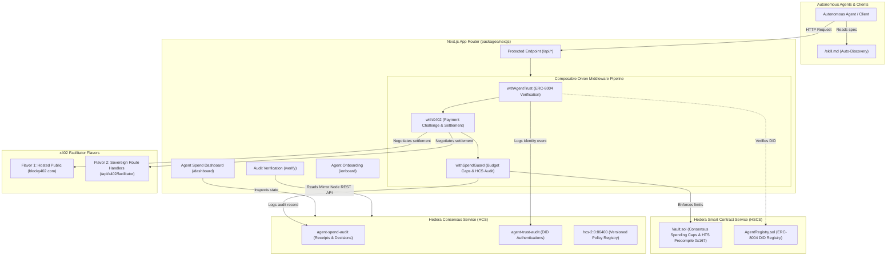

# Technical Architecture & Systems Reference

This document provides in-depth technical specifications, smart contract mechanics, middleware execution pipelines, and consensus audit specifications for Scaffold-HBAR Agent & Machine Payments.

---

## 1. System Architecture Map



---

## 2. Composable Middleware Onion Pipeline

All protected API endpoints scaffolded via `yarn script:make-route` compose three modular, decoupled middleware layers:

```typescript
export const GET = withAgentTrust(
  withX402(
    withSpendGuard(handler, { maxPriceHbar: 10, recordAudit: true }),
    { priceTinybar: "50000000", payTo: PAY_TO, memo: "x402-sentiment" }
  )
);
```

### Execution Lifecycle

1. **`withAgentTrust` (ERC-8004 Cryptographic Identity)**
   - Extracts `X-Agent-DID`, `X-Agent-Signature`, and `X-Agent-Timestamp` headers.
   - Validates that the timestamp falls within a 5-minute replay protection window.
   - Queries `AgentRegistry.sol` on Hedera Smart Contract Service (HSCS) to verify that the DID exists, is active, and matches the signing key.
   - Logs an identity authentication record to the `agent-trust-audit` HCS topic.
   - Injects the authenticated `agent` context into downstream handlers.

2. **`withX402` (Micro-Payment Challenge & Settlement)**
   - Checks incoming requests for the `PAYMENT-SIGNATURE` HTTP header.
   - **Challenge Negotiation:** If missing, aborts execution immediately with HTTP `402 Payment Required`, returning a structured JSON challenge containing `priceTinybar`, `payTo`, network identifier (`hedera-testnet`), and unique transaction memo.
   - **Payment Verification:** If `PAYMENT-SIGNATURE` is present, validates the signed `TransferTransaction` against the active facilitator (`blocky402.com` or local sovereign route handlers).
   - Injects the verified `payment` receipt into downstream handlers.

3. **`withSpendGuard` (Non-Custodial Financial Governance)**
   - Compares the request price against configured maximums (`maxPriceHbar`, rolling 24-hour budgets).
   - Reserves atomic holds in memory to prevent race-condition overdrafts.
   - Submits consensus-timestamped audit records (`ALLOW`, `BLOCK`, or `ESCALATE`) to the `agent-spend-audit` HCS topic.
   - Injects the `guard` context into the developer's core business handler.

---

## 3. Smart Contracts & Native Precompiles

### `Vault.sol` — Consensus Spending Caps & HTS Precompile

Located in `packages/hardhat/contracts/Vault.sol`, the Vault smart contract enforces autonomous spend ceilings directly at the consensus layer.

- **Non-Custodial Governance:** Funds deposited into the Vault cannot be drained arbitrarily by autonomous agents. Each agent address is allocated a maximum task allowance and a rolling daily limit.
- **Hedera Token Service (HTS) System Contract `0x167`:**
  - Disbursements use the official Hedera Token Service precompile at address `0x0000000000000000000000000000000000000167`.
  - Executes low-level `cryptoTransfer` calls for native HBAR and HTS token disbursements.
- **Deposit & Disbursement Hooks:**
  ```solidity
  function disburseHbar(address payable recipient, int64 amountTinybar) external onlyAuthorizedAgent {
      require(amountTinybar <= agentDailyAllowance[msg.sender], "Vault: Daily spend cap exceeded");
      // Precompile cryptoTransfer disbursement via 0x167
  }
  ```

### `AgentRegistry.sol` — ERC-8004 Identity Registry

Located in `packages/hardhat/contracts/AgentRegistry.sol`, the registry implements on-chain Decentralized Identifiers (DIDs) for autonomous agents.

- **Storage:** Maps agent EVM addresses and Hedera account IDs to registered DIDs, service endpoint URLs, and public verification keys.
- **Lifecycle Management:** Supports registration, endpoint updates, cryptographic rotation, and administrative deactivation.
- **Sybil Resistance:** Optional registration fee in tinybars forwarded to the contract owner.

---

## 4. Multi-Tier Spend Guard Engine

Located in `packages/nextjs/services/guard`, Spend Guard implements a defense-in-depth enforcement ladder:

| Layer | Tier Name | Execution Target | Behavior |
| --- | --- | --- | --- |
| **L0** | Pre-Flight Memory Checks | Application Server | Validates counterparty allowlists, blocked tool signatures, and parameter structures before network transmission. |
| **L1** | Atomic Reservations & Rolling Budgets | Application Server | Calculates rolling 24-hour spend against `perDayHbar` caps and places atomic reservations to prevent parallel overdrafts. |
| **L2** | On-Chain Consensus Vault | Hedera Network (HSCS) | If configured (`VAULT_CONTRACT_ID`), `Vault.sol` enforces hard cryptographic spend ceilings that cannot be bypassed even if the application server is compromised. |
| **Escalation** | Human-in-the-Loop (HIP-423) | Hedera Network (HSS) | Requests exceeding autonomous caps construct a `ScheduleCreateTransaction`, record an `ESCALATE` entry on HCS, and return a `scheduleId` for manual multisig signing. |

---

## 5. Hedera Consensus Service (HCS) Audit Architecture

Scaffold-HBAR provisions three independent HCS topics during infrastructure preparation (`yarn script:prepare`):

### 1. Spend Audit Topic (`agent-spend-audit`)
- Records all payment decisions and settled receipts.
- **Message Payload Schema:**
  ```json
  {
    "type": "SPEND_AUDIT",
    "version": "1.0",
    "timestamp": 1743781200000,
    "decision": "ALLOW",
    "amountTinybar": "50000000",
    "payerAccountId": "0.0.12345",
    "recipientAccountId": "0.0.67890",
    "route": "/api/sentiment",
    "transactionId": "0.0.12345@1743781195.000000000"
  }
  ```

### 2. Trust Audit Topic (`agent-trust-audit`)
- Records identity registrations, authentication attempts, and cryptographic key revocations.

### 3. Policy Registry Topic (`hcs-2:0:86400`)
- Follows the HCS-2 versioned topic standard.
- Submissions require the merchant operator submit key.
- Enables public mirror nodes to reconstruct the complete policy history chronologically without querying private databases.
